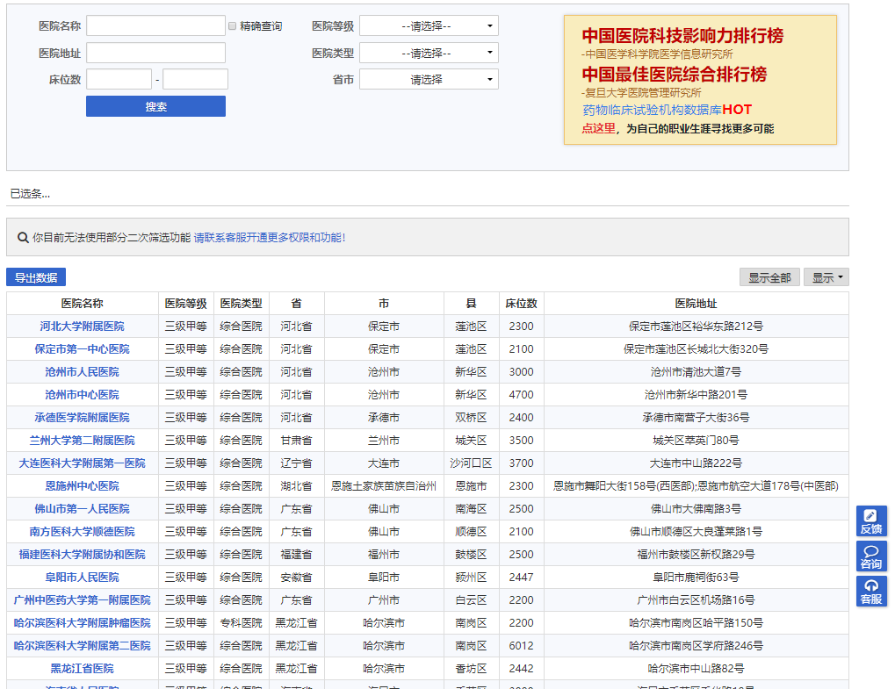
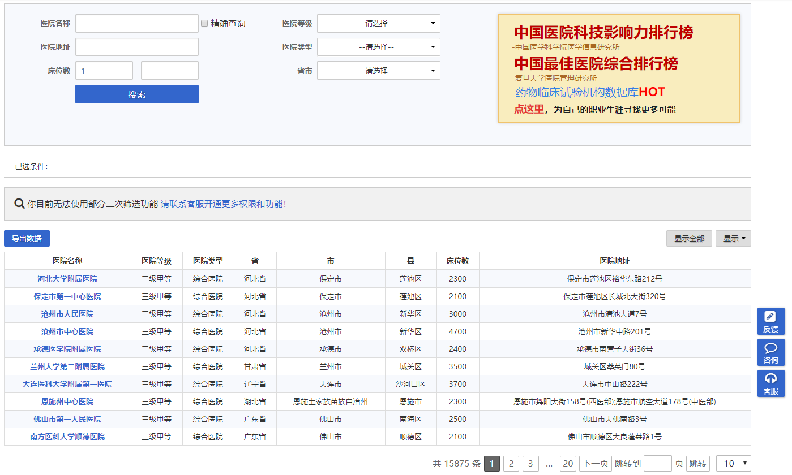

# 药智医院数据爬虫（*YaozhiSpider*)

## 项目简介

1. [源网址](https://db.yaozh.com/hmap?name=&grade=%E5%85%A8%E9%83%A8&address=&type=%E5%85%A8%E9%83%A8&bedstr=&bedend=&province=%E5%85%A8%E9%83%A8) 

2. 目标界面截图

3. 数据特征

  - 有床位数据的医院数量有限，只有`15875`条
  
## 最新结果

1. 有床位的数据可以获取到`15241`个

## 主要困难

1. 数据显示限制： 每次查询只能显示`200`条数据，需要限制查询条件以使得访问数据小于等于200

2. 无法限制数据较多： 例如部分`未定级`医院即使限定省份等，依旧超过200条。后续计划`地址（区县级别）`+`未定级`限定访问

## 项目代码描述

### 数据文件

1. 不同检索级别的对应的数据条数
  - 省份检索的任务 [task_prv.csv](_utils/task_prv.csv)
  - 省份+市区级地址检索的任务 [task_city.csv](_utils/task_city.csv)
  - 省份+县级地址检索的任务 [task_cnty.csv](_utils/task_cnty.csv)
  - 省份+医院级别检索的任务 [task_grade.csv](_utils/task_grade.csv)
  - 省份+医院类别检索的任务 [task_type.csv](_utils/task_type.csv)